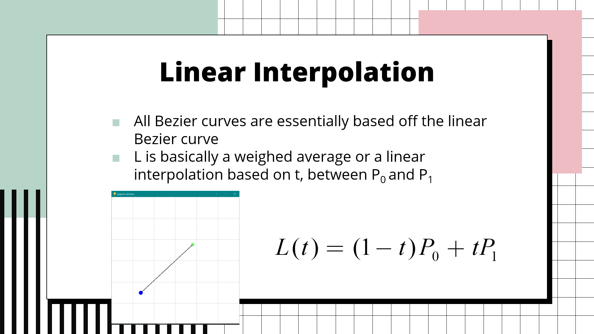

# 4253B Bezier Curve Visualizer 

Foobar is a Python library for dealing with word pluralization.

## Installation

1. Install [python](https://www.python.org/downloads/)
2. Run ``main.py``

## Usage

* Left-click colored circles to move waypoints around
* Right-click to create more waypoints
* Press ``F`` to generate waypoint locations

## What are Bezier Curves?

For a more detailed explanation, check out this [video](https://www.youtube.com/watch?v=aVwxzDHniEw)!

## Contributing
Pull requests are welcome. For major changes, please open an issue first to discuss what you would like to change.

## License
[MIT](https://choosealicense.com/licenses/mit/)
